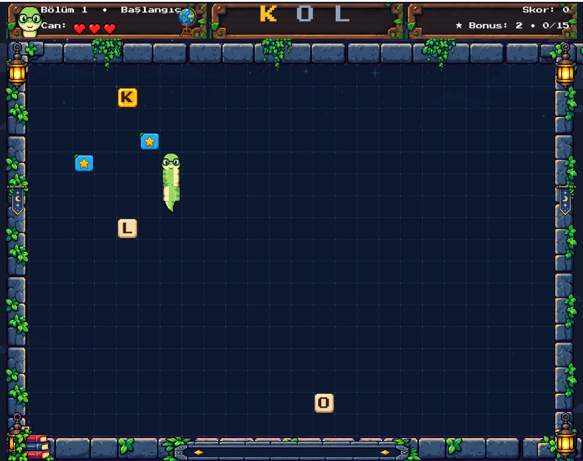
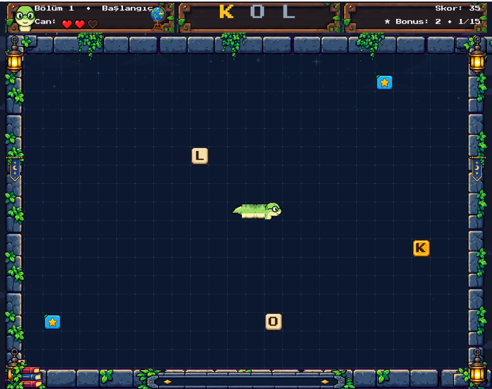

# 🐍 Harf Yılanı

Klasik yılan oyununun **Türkçe kelime öğrenme** sürümü. Yılan harfleri, hedef
kelimenin harflerini **doğru sırayla** yer. Türkçe alfabesi tam desteklidir
(Ç, Ğ, İ, Ö, Ş, Ü).

Bu depo oyunun **iki sürümünü** birlikte barındırır:

| Sürüm | Klasör | Teknoloji |
|---|---|---|
| 🎮 Masaüstü | [`godot-project/`](godot-project/) | **Godot 4.7** (GDScript) |
| 🌐 Web | depo kökü | Next.js + TypeScript + Tailwind + Prisma |

## 🖼 Ekran görüntüleri

| Menü | Oyun |
|---|---|
|  |  |

## 🎮 Nasıl oynanır

Üstteki hedef kelimenin **sıradaki harfini** yersen yılan uzar ve puan kazanırsın.
**Yanlış harf** yersen bir can gider.

| Tuş | İşlev |
|---|---|
| ← ↑ → ↓ / WASD | Yön |
| P veya Esc | Duraklat / devam et |
| Enter veya Space | Menüyü başlat |
| Esc (menüde) veya **ÇIKIŞ** butonu | Oyundan çık |

### Kurallar (özet)

- **Doğru harf** → yılan uzar, puan artar, kelime ilerler
- **★ Yıldız (bonus)** → +25 puan, combo +1; **her 15 yıldızda 1 kuyruk düşer**
- **İksir (hız artırıcı)** → kısa süre hızlı hareket
- **Taş engel** → çarparsan ölürsün (6. bölümden itibaren çıkar)
- Duvarlar öldürmez; yılan karşı taraftan girer
- 3 can

## 🚀 Hızlı başlangıç

### Masaüstü (Godot)

1. [Godot 4.7+](https://godotengine.org/download) indir
2. Godot → **Import** → `godot-project/` klasörünü seç
3. **F5** ile çalıştır

Çalıştırma, klasör yapısı ve test ayrıntıları: [`godot-project/README.md`](godot-project/README.md)

### Web

```bash
npm install
npm run dev        # http://localhost:3000
```

Diğer scriptler: `npm run build`, `npm start`, `npm run lint`.
Veritabanı tarafı `prisma/` altındadır; gerekiyorsa kendi `.env` dosyanı
oluştur (`.env` bilinçli olarak depoda tutulmaz).

## ✅ Testler

Oyun kurallarını gerçekten çalıştıran headless test paketi
(`godot-project/tests/test_game.gd` → **368 kontrol**):

```bash
godot --headless --path godot-project --quit res://tests/test_game.tscn
# SONUÇ: 368 geçti, 0 başarısız
```

## 🎨 Varlık (asset) üretimi

Piksel varlıklarının tamamı Python + Pillow ile üretilir ve **kaynak kit
sayfaları depodadır** — yani varlıkları sıfırdan üretebilirsin:

```bash
cd godot-project/tools
python build_snake_v2.py && python refine_snake.py --apply   # yılan atlası
python measure_head_ratio.py                                 # ölçüm doğrulaması
```

Araçlar taşınabilirdir (mutlak yol içermez); ölçülen sözleşmeler ve zincir
sırası: [`godot-project/tools/README.md`](godot-project/tools/README.md)

## 📄 Lisans

[MIT](LICENSE) © 2026 oktaycosar
